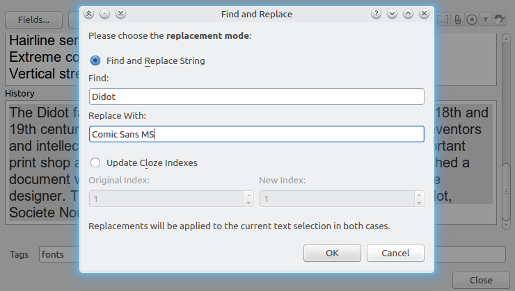

## Find and Replace in Editor Add-on for Anki

This is an add-on for the spaced-repetition flashcard app [Anki](https://apps.ankiweb.net/). It provides a find and replace dialog in the Editor that alternatively allows for free-form text replacements or updating cloze indexes in selected text.

### Table of Contents

<!-- MarkdownTOC -->

- [Screenshots](#screenshots)
- [Installation](#installation)
- [Documentation](#documentation)
- [License and Credits](#license-and-credits)

<!-- /MarkdownTOC -->

### Screenshots

### Installation

*AnkiWeb*

[Link to the add-on on AnkiWeb]()

*Manual installation*

1. Go to *Tools* -> *Add-ons* -> *Open add-ons folder*
2. Find and delete `Find and Replace in Editor.py` and `editor_find_replace` if they already exist
3. Download and extract the latest add-on release from the [releases tab](https://github.com/Glutanimate/editor-find-replace/releases)
4. Move `Find and Replace in Editor.py` and `editor_find_replace` into the add-ons folder
5. Restart Anki

### Documentation

For further information on the use of this add-on please check out [the original add-on description](docs/description.md).

### License and Credits

*Find and Replace in Editor* is *Copyright © 2017 [Aristotelis P.](https://glutanimate.com/)*

Licensed under the [GNU AGPLv3 or later](https://www.gnu.org/licenses/agpl.html).
